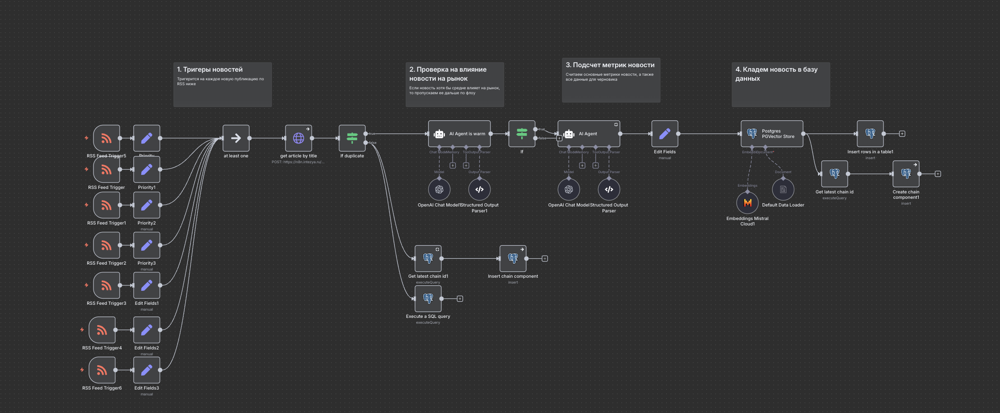
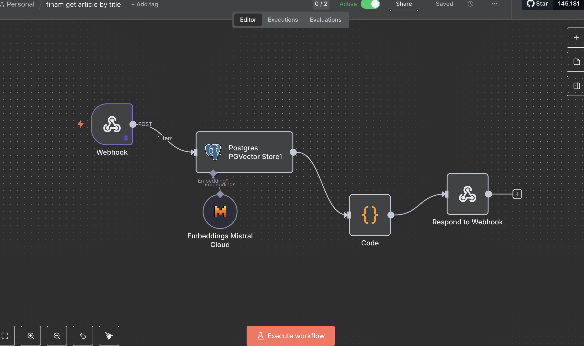
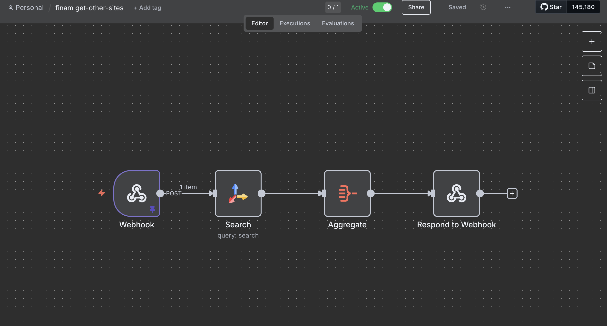
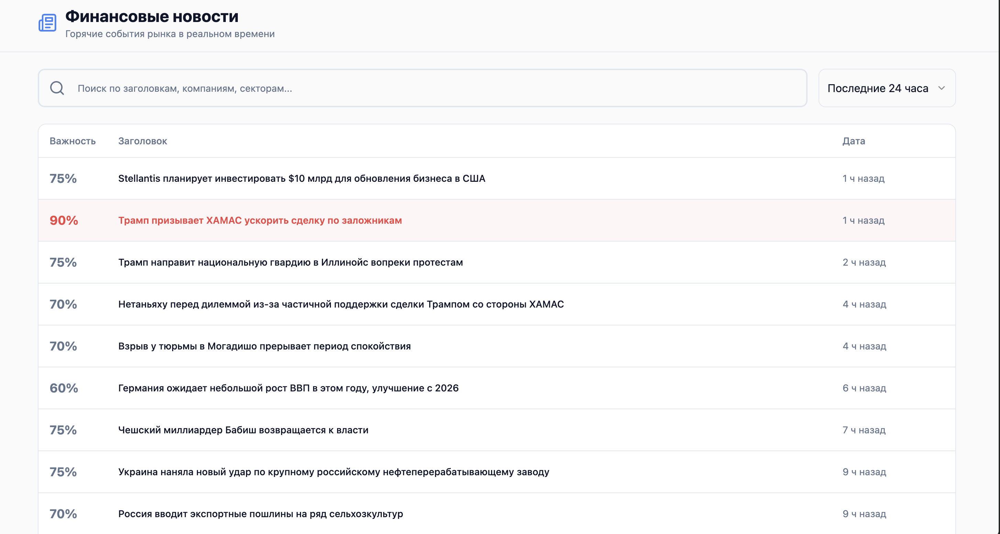

# Cucat описание решения

# Флоу в n8n от новостей до пользователя

## 1. Реагируем на новости которые вышли и сохраняем их



## 2.  При реакции на новость ищем дубликаты с помощью векторов



## 3. Если пользователь хочет узнать все источники где есть i-ая новость, то он вызывает ручку под поиск всех новостей на tavily



# UI (website)

[Ссылка тут](https://preview--fin-feed-analyzer.lovable.app/)



- На фронте можно фильтровать новости за последние 24 часа (летит запрос на бэк в н8н).
- Просматривать всю инфу собранную н8н по каждой новости.

# Про метрики

```jsx
1. HOTNESS SCORE (0-1): Оцени по критериям:
   - Неожиданность относительно рыночного консенсуса (30%)
   - Материальность для цен активов (25%) 
   - Скорость распространения в медиа (20%)
   - Широта затронутых активов (25%)
```

Промпт на хотнесс скор был сделан с помощью других ллм (200+ сайтов ресерча про анализ новостей для создания отношений в промпте) и сравнивался по датасетам с кагл и hugoface.

## Полный промпт для анализа выглядит так

```jsx
ВХОДНЫЕ ДАННЫЕ: {news_headline} {news_content} {publish_time}

Ты - эксперт по анализу финансовых новостей. Проанализируй следующий текст и определи:
переведи на русский все поля

ЗАДАЧИ АНАЛИЗА:
1. HOTNESS SCORE (0-1): Оцени по критериям:
   - Неожиданность относительно рыночного консенсуса (30%)
   - Материальность для цен активов (25%) 
   - Скорость распространения в медиа (20%)
   - Широта затронутых активов (25%)

2. ИЗВЛЕЧЕНИЕ СУЩНОСТЕЙ:
   - Компании (с тикерами если возможно)
   - Страны и регионы
   - Финансовые инструменты
   - Ключевые персоны

3. WHY NOW: Объясни в 1-2 предложениях почему это важно именно сейчас

4. ЧЕРНОВИК ПОСТА:
   - Цепляющий заголовок (до 60 символов)
   - Лид-абзац с главной мыслью
   - 3 ключевых пункта (буллеты)
   - Заключительная мысль с источниками

ФОРМАТ ОТВЕТА: Строго JSON без дополнительного текста, переведи на русский все поля
:
{
  "hotness_score": 0.85,
  "entities": {"companies": ["Apple", "AAPL"], "sectors": ["Tech"], "people": ["Tim Cook"]},
  "why_now": "Earnings превысили прогнозы на 15%, подтверждение от 3 источников за 2 часа",
  "sentiment": "bullish",
  "impact_level": "high",
  "affected_assets": ["AAPL", "QQQ", "TECH sector ETFs"],
  "draft": {"headline": "Apple crushes Q4 expectations", "lead": "...", "bullets": ["...", "...", "..."], "conclusion": "..."},
"publish_date": {}
}

```
